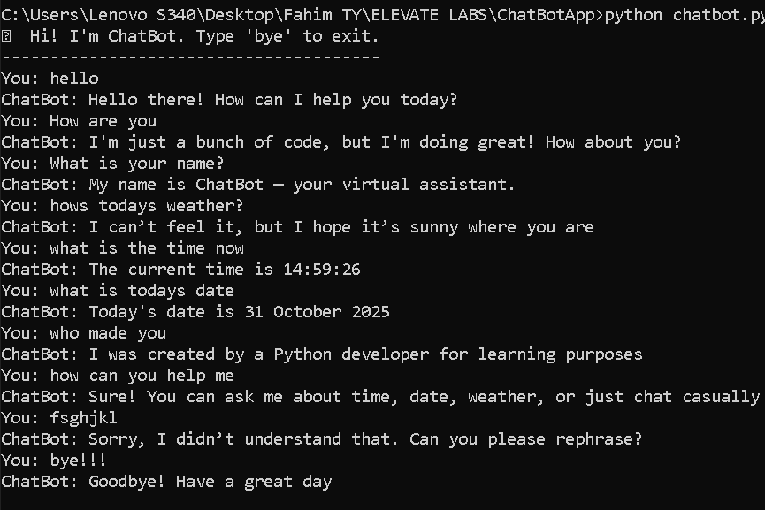

# 🤖 Simple Rule-Based Chatbot

A simple **rule-based chatbot** built in **Python** using basic `if-elif-else` logic.  
It interacts with the user, answers common questions, and simulates basic conversational behavior.

## ⚙️ How to Run :
1. Make sure **Python** is installed.  
    Check with:
    python --version
2. Open CMD or VS Code Terminal.

3. Navigate to the folder where chatbot.py is saved:
    cd path/to/your/project
4. Run the file:
    python chatbot.py

## 🖼️ Example Output

## 📋 Features
- Built using if-else logic

- Responds to greetings, time, date, and small talk

- Simple and easy to understand

- Runs directly in the command line

- Helps in learning basic NLP structure

## 🎯 Outcome
Understood how rule-based chatbots work using simple Python conditionals.

## 👨‍💻 Author
**Fahim Shaikh**
SY BTECH in Computer Science & Engineering